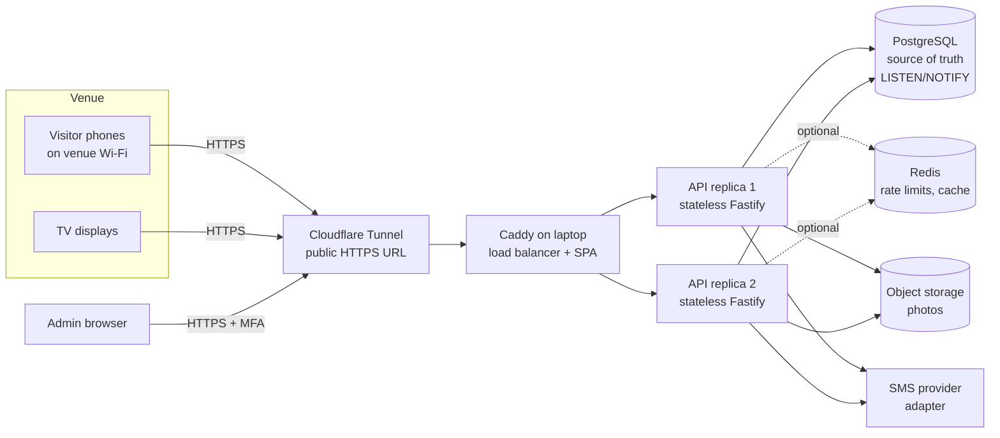

# MC2026 Digital Voting System: Project Master Plan

**Status:** ✅ Approved 2026-10-06 (with revisions: ADR-002, ADR-003) · **Date:** 2026-10-06
**Sources:** `MC2026_Voting_System_Challenge_and_Rubric.docx`, `Branding Guildine/` (brand PDF, Nexa and Helvetica Neue Arabic fonts)

---

## 0. What wins this challenge (requirements distilled)

| Rubric criterion | Weight | What gets a "5" | Our answer |
|---|---|---|---|
| Problem understanding & fit | 15% | Shows clear thinking about the real event | Real venue realities: shared Wi-Fi NAT, visitors on 4G, Arabic speakers, TV glare, pitch-room demo |
| Functional completeness | 20% | Full flow works reliably, including admin | End-to-end path working by Phase 4, admin by Phase 6 |
| Access control & anti-fraud | 20% | On-site + mandatory OTP + secure PII | Layered access policy, DB-enforced uniqueness, encrypted PII |
| Scalability & soundness | 15% | Credible plan **and evidence** for 1,000 concurrent users | Stateless replicas, k6 load-test report, live "kill a server" demo |
| UX & design | 15% | Polished, intuitive, on-brand on both interfaces | Bilingual AR/EN mobile flow and a broadcast-grade TV board |
| Pitch & demo | 15% | Smooth live demo, strong Q&A | Scripted demo, seeded data, backup video, Q&A sheet |
| **Tiebreaker** | n/a | Most complete on-site access control (F10/F11) | Our biggest investment area (see §1.2) |

Requirement IDs F1–F14 and the non-functional requirements (NFRs) are traced in `docs/traceability.md`, which is created in Phase 0 and updated every phase.

---

## 1. MCP research summary

Sources: Firecrawl web research (OWASP, Twilio, MaxMind, APNIC, arXiv, Clyde & Co) and Context7 docs (Fastify v5, @fastify/sse, Drizzle ORM).

### 1.1 SMS OTP security (OWASP MFA Cheat Sheet, Twilio Verify fraud docs, Prelude)
- **OWASP minimums:** short TTL, single use, strict attempt limits, invalidate on success. Never log OTPs, never store them in plaintext, and use a CSPRNG. A resend creates a **new** code that overwrites the old one.
- **NIST SP 800-63B-4 treats SMS as a "restricted" authenticator** (SS7 interception, SIM swap). In our setting OTP proves *phone ownership for deduplication*; it does not protect an account. The risk acceptance is documented as an ADR (required by OWASP).
- **SMS pumping / toll fraud is the main financial risk.** Mitigations: an allow-list of destination countries and prefixes (Jordan mobile only: `+9627[789]`), exponential resend delays, per-phone, per-device and per-IP limits, and monitoring of the OTP **conversion rate** (sent vs. verified), with an alert when it drops.
- **Venue-specific insight:** hundreds of visitors on venue Wi-Fi share **one public IP (NAT)**. Per-IP limits must therefore be generous, and the strict limits go per phone and per device. A naive per-IP limiter would lock out the whole venue.

### 1.2 On-site restriction (APNIC, arXiv CPV paper, MaxMind, Acre Security)
- **Browser geolocation can't be trusted on its own.** The server receives coordinates from the client, and those "can easily be forged on the fly."
- **IP geolocation only works to city level** (MaxMind: 20–75% city accuracy, worse on mobile carriers and CGNAT). It is useless for "inside this hall."
- **An IP *allow-list* of the venue's egress IP is strong,** but it only covers visitors on venue Wi-Fi. Visitors on 4G/5G would be locked out.
- "No single geolocation method is sufficient" (Acre). Industry anti-fraud attendance systems use a **rotating QR code** to prove physical presence without GPS.
- **Our design (revised 2026-10-06, ADR-002): two strict factors, the venue network plus a verified phone.**
  1. **Venue network (IP/CIDR allow-list):** the venue Wi-Fi's public egress IPs are stored in the database and edited live from admin. Requests from any other IP are rejected at the API, not just hidden in the UI. The client IP is derived **only** from a trusted hop: Caddy's address, and when tunnelled, the tunnel connector's `CF-Connecting-IP` / `X-Forwarded-For`. That way the header can't be spoofed by a direct caller (Fastify docs warn about this explicitly).
  2. **Strict SMS OTP:** see §1.1. Mandatory before any vote is accepted.
  - **Dropped on purpose (organiser decision):**
    - *Browser GPS:* signal jamming in Jordan makes it highly inaccurate, and it is spoofable anyway.
    - *Rotating TV QR:* screens aren't visible everywhere, so it would force visitors to walk across the hall.

    Visitors scan a **static printed QR** at the entrance or booths instead. This is a strength in the pitch: we evaluated these layers and rejected them for evidence-based reasons.
  - **The resulting UX rule:** a visitor on 4G gets a friendly "Join the *MC2026* Wi-Fi to vote" screen, with the network name and password shown, and a "Try again" button that re-checks instantly.
  - Access modes stored in the database: `IP_ALLOWLIST` (event), `OFF` (development and testing only, flagged loudly in the admin UI). The IP check runs at **OTP request, OTP verify, and vote cast**, and each vote stores the client IP for audit.

### 1.3 Duplicate-vote prevention & integrity (Irina Scurtu, VoteGuard, DEV/Postgres)
- "One vote per person is a concurrency problem before it's a counting problem." Application-level "check then insert" has a race condition. **The database must be the referee:**
  - `UNIQUE (visitor_id, category_id)` on `votes`, combined with `INSERT … ON CONFLICT DO NOTHING`.
  - A composite FK `(exhibitor_id, category_id) → exhibitor_categories` makes it *impossible* to vote for an exhibitor outside the chosen category.
  - Phones are normalised to E.164 (`libphonenumber-js`) before hashing, so `0791234567`, `+962791234567` and `00962 79…` are the same visitor.
  - Each request carries an `Idempotency-Key`, so client retries after network drops are safe.

### 1.4 Real-time (Ably, SurveySparrow engineering, @fastify/sse docs)
- The flow is one-way, server to TV, so **SSE beats WebSockets** here. It runs over plain HTTP, the browser reconnects automatically, `Last-Event-ID` provides replay, and it works through proxies.
- Fan-out across replicas: the database notifies every API instance, and each instance pushes to its own SSE clients. We use **Postgres `LISTEN/NOTIFY`**, which keeps Redis off the critical path (see §3.3).
- Updates are **coalesced** (at most one snapshot per 500 ms–1 s per instance), so a vote burst does not flood the TVs. On reconnect, the server sends a full snapshot plus a version number, so a TV can never show stale partial data.

### 1.5 Privacy and law: Jordan PDPL No. 24 of 2023, in force since 17 March 2024 (Clyde & Co)
- Consent must be **prior, clear, written, plain-language, and for a specified purpose and period.** F14 ("future outreach") therefore needs an explicit consent checkbox for outreach, kept separate from the consent needed to vote. We store the consent timestamp and the consent-text version.
- Rights to access, withdraw, rectify and erase → admin "delete visitor" tooling (their votes stay counted via anonymised retention; this choice is recorded in an ADR).
- Breach notification: data subjects within 24 h and the regulator within 72 h. This goes into a short incident runbook in the docs.
- Integrity and confidentiality → field-level encryption of name and phone, an admin-only access path, and audit logging of every PII view or export.

---

## 2. UI/UX & design strategy

### 2.1 Brand system (extracted from the guidelines)

| Token | Hex | Role in our UI | Contrast note |
|---|---|---|---|
| Navy Blue | `#00007b` | Primary text, headers, TV background | AAA on white |
| Deep Purple | `#7f32d9` | Primary action buttons, selection state | ≈6.2:1 with white → AA ✓ |
| Royal Blue | `#4a68d8` | Secondary actions, links, info | ≈4.9:1 with white → AA ✓ |
| Turquoise | `#74dccf` | Success / "voted" state (navy text on it) | Never white text on turquoise |
| Warm Yellow | `#f8d749` | Highlights, the TV leader, the "LIVE" badge | **Never** on white; use on navy |
| Crimson | `#a52a3a` | Errors, "voting closed" | AA with white ✓ |

- **Type:** Nexa (Heavy/Bold for display, Book/Regular for UI) for Latin; Helvetica Neue LT Arabic (75 Bold / 45 Light / Roman) for Arabic. Fonts are self-hosted as subset `woff2` files with `font-display: swap`.
  - ⚠️ Nexa is a commercial font, so CPF's licence must cover web embedding (open question).
- **Motifs** from the brand "Elements & Pattern" page:
  - Gear (Innovation) → the loading spinner.
  - Circles (Community) → avatar frames.
  - Triangles and arrows (Entrepreneurship), plus the ▶▶▶ navy→blue→turquoise chevrons from the cover → our **progress indicator**.
  - Spiral and light rays (Empowerment) → the success celebration.
- **Logo:** the folder only provides it inside the PDF. In Phase 0 we extract a vector SVG (`pdftocairo -svg` plus a crop) for both the bilingual lockup and the compact one.

### 2.2 Mobile voting experience: zero learning curve

**Principles:**
- One decision per screen, with the primary button in the thumb zone.
- Arabic-first with a one-tap EN toggle and full RTL support via CSS logical properties.
- 48 px minimum tap targets; inputs ≥ 16 px so iOS doesn't zoom.
- Plain-language errors that always say *what to do next*.

```
① Welcome        ② Your details       ③ Code             ④ Vote hub            ⑤ Pick exhibitor     ⑥ Confirm sheet
[logo]           Name ________        ┌┐┌┐┌┐┌┐┌┐┌┐        ▶▶▶ 1 of 3 voted      🔍 search            [photo]
"Vote for your   +962 │7X XXX XXXX    autofill from SMS   ✓ Best Innovation     [photo] Name         "Vote for Maker X
 favourite        ☐ I agree to vote   Resend in 0:45      ○ Community Choice    short desc  ›         in Community?"
 makers"          ☐ Keep me updated                        ○ Best Design         [photo] Name   ›     [Confirm vote]
[ابدأ / Start]    [Send code]          [Verify]                                                       Change
```

- **OTP:** `autocomplete="one-time-code"` (iOS autofill) plus the WebOTP API (Android). This is a one-tap, no-typing verification, which is the single biggest friction killer.
- **Vote hub:** shows the 3 categories with clear ✓ / ○ state (F3) and the chevron progress bar. Finishing all three triggers a celebration screen (spiral and rays animation, haptic `vibrate`).
- **Confirmation step:** a bottom sheet with the photo, because votes are final. Accidental taps are the #1 complaint in event voting.
- **Exhibitor list (F1):** large photo cards, instant client-side search, lazy-loaded responsive WebP images, skeleton loaders.
- **Resilience:** an offline banner plus automatic retry with the same idempotency key. The UI never shows a false "voted."
- **Access-denied screen (not on venue Wi-Fi):** never a dead end. It shows "Join the *MC2026* Wi-Fi to vote" with the network name and password (both from the database), plus a "Try again" button. The entry point is a **static printed QR** at the entrance and booths.
- **Performance budget:** voter route JS < 150 KB gzipped, LCP < 2 s on mid-range Android over 4G, Lighthouse mobile ≥ 90 (Perf) / ≥ 95 (A11y).

### 2.3 Live TV dashboard: readable from the back of the hall

- **Layout:** 1920×1080 on a navy background (less glare, on brand), with **3 columns, one per category**. Each column has a category colour accent, the top 5 exhibitors with photo, name, animated bar and count, and the leader highlighted in yellow.
- **Typography:** nothing under ~40 px at 1080p; exhibitor names ≥ 56 px; leader count ≥ 96 px.
- **Motion:** FLIP rank-change animations and count tickers, kept calm rather than flashy. `prefers-reduced-motion` is respected.
- **Header strip:** logo, a pulsing **LIVE** badge, total votes, a countdown to voting close, and the **static** "Scan to vote" QR (it encodes the public voting URL, so it is safe to show anywhere).
- **Display modes, controlled from admin (`results_visibility` in the database):**
  - *Live*: real-time standings.
  - **Blind Hour / Freeze (ADR-003).** The admin toggles it, and every TV switches within ≤ 1 s to a branded suspense screen. It keeps the standings frozen as they were at the moment of freezing (or optionally shows no standings at all), with a "Results are sealed, winners announced soon" message and an animated gear motif. Voting is untouched: the backend keeps accepting and counting votes normally.
    - **Security rule:** the freeze is enforced **server-side**. While frozen, the public/display SSE stream and every public endpoint only send the snapshot stored at freeze time (`frozen_snapshot` + `frozen_at`), or nothing in hide mode. Live counts never reach a TV browser, so DevTools, the network tab or a refresh can't leak them.
    - Only authenticated admins see live counts during the Blind Hour, and viewing them is recorded in the audit log.
  - *Reveal*: after the Blind Hour, the admin reveals winners category by category with a full-screen spotlight. This is the pitch-day "wow" moment.
- **Never a blank screen:** the last snapshot stays on screen. A subtle "reconnecting…" chip appears after 5 s offline. A slow pixel drift prevents burn-in.
- **Protection:** each TV is paired with a revocable **display token** created in admin (role `DISPLAY`, read-only, no PII).

### 2.4 Admin console (desktop-first, clarity over flash)

- Overview: live counts, a voting window toggle with typed confirmation, a **Blind Hour toggle** (Live ⇄ Frozen ⇄ Reveal, with a confirmation step) and fraud signals (OTP conversion, votes/min, top devices).
- Exhibitors (CRUD with drag-drop photo, crop and multi-category assignment) and Categories.
- Settings: window times, venue IP CIDRs (with a "Add my current IP" helper for setup), Wi-Fi name and password shown to blocked visitors, access mode, allowed phone prefixes.
- Displays, Export (CSV/XLSX), Visitors (masked PII), Audit log, Admin users and MFA.

The **impeccable** design skill is used for critique and polish passes at the end of each UI phase.

---

## 3. Tech stack & architecture

### 3.1 Stack

| Layer | Choice | Why it wins here |
|---|---|---|
| Language | **TypeScript (strict) end-to-end**, Node 22 LTS | One language means shared validation schemas front and back, and a small team moves fast |
| Monorepo | **pnpm workspaces** | `shared` package for types and Zod schemas; one CI |
| API | **Fastify 5** + `@fastify/sse`, `@fastify/rate-limit`, `@fastify/helmet`, `@fastify/cookie`, `@fastify/multipart`, Zod type provider | Among the fastest Node frameworks; schema-first validation; first-party SSE with replay |
| Database | **PostgreSQL 16** + **Drizzle ORM** / drizzle-kit migrations | DB-enforced integrity (unique/FK), `LISTEN/NOTIFY` for fan-out, SQL-transparent ORM |
| Cache / limits | **Redis 7** (shared rate-limit store, read cache) | Shared limits across replicas; **optional**: if Redis is down, limits degrade to in-process memory and voting continues |
| Object storage | `StorageProvider` interface: **shared Docker volume** (laptop demo; both replicas mount it) or **S3-compatible** (cloud); `sharp` resizes, converts to WebP and strips EXIF | Replicas stay stateless with no extra MinIO service to run during a 2-day build |
| Frontend | **React 19 + Vite**, React Router (code-split: `/vote`, `/live`, `/admin`), TanStack Query, **Tailwind CSS v4** with brand tokens, Motion for animation, i18next (AR/EN, RTL) | Fast and lightweight; admin code never ships to voters |
| SMS | `SmsProvider` interface: `ConsoleProvider` (dev/tests), **`TwilioProvider`** (Programmable Messaging; **we** generate, hash and verify the OTP, so our controls work with any gateway), `GenericHttpProvider` (CPF's future gateway) | Twilio for the pitch; CPF's gateway becomes a config switch |
| Admin auth | argon2id, TOTP MFA (RFC 6238) + recovery codes, DB-backed sessions, RBAC (`SUPER_ADMIN`, `ADMIN`, `DISPLAY`) | Meets "username + password, MFA if possible" in full |
| Edge | **Caddy** load-balances ≥ 2 API replicas and serves the SPA; **Cloudflare Tunnel** (`cloudflared`) gives a public HTTPS URL to the laptop for the demo | No cold starts; Secure cookies need HTTPS; real client IP is taken from the tunnel's `CF-Connecting-IP` only when the immediate peer is the trusted connector |
| Packaging | **Docker Compose** (local or single VM); docs for managed cloud | "Deployable on local server or cloud without special hardware" |
| Quality | Vitest (unit + integration against a real Postgres via Testcontainers), Playwright (E2E, mobile viewports), **k6** (load), ESLint, Prettier | Evidence-based quality claims |
| Security tooling | gitleaks, osv-scanner / `pnpm audit`, Semgrep (OWASP rules), OWASP ZAP baseline (DAST) | Automated checks back up the manual reviews |
| CI | GitHub Actions: lint → typecheck → test → security scans → build images | Every merge is gated |

**Alternatives considered:**
- *Next.js full-stack:* long-lived SSE connections and stateless replicas are less natural.
- *Firebase/Supabase:* fast to build, but weaker on "deployable locally" and gives less control over access-policy logic.
- *Socket.io:* two-way transport we don't need.

### 3.2 System architecture



**Vote path:**
1. `POST /api/votes` arrives at any replica.
2. Session check (signed cookie).
3. Venue-IP re-check and voting-window check.
4. Transaction: `INSERT … ON CONFLICT DO NOTHING`, then `NOTIFY votes`.
5. Respond `201` (or `200 already-voted`).
6. Every replica's listener marks the leaderboard dirty → the coalescing ticker (≤ 1 s) runs one `GROUP BY` query → SSE push to that replica's TVs, **unless `results_visibility` is FROZEN/HIDDEN**, in which case TVs only ever receive the stored frozen snapshot.

### 3.3 Statelessness, reliability & scale (NFRs)

- **Stateless API:**
  - Voter sessions are short-lived signed cookies (`HttpOnly; Secure; SameSite=Lax`), so no server memory is needed.
  - Admin sessions live in Postgres.
  - Photos live in object storage.
  - Any replica can die without anyone losing their session.
- **No single point of failure that pauses voting:**
  - Two or more API replicas sit behind Caddy health checks.
  - Redis is optional (degrades gracefully).
  - The SMS provider is behind an adapter with a timeout and a circuit breaker.
  - Postgres is the one hard dependency. Compose runs a single node; production docs specify managed Postgres with a hot standby.
  - Network drops are handled by idempotent retries, SSE auto-reconnect with snapshots, and an offline banner.
- **Capacity reasoning:** 1,000 visitors × ~10 requests ≈ 10k requests in total; a worst-case burst (everyone votes within 5 min) ≈ 35 req/s. Postgres handles ~3,000 votes trivially. We will **load-test at 10× (1,000 virtual users, full flow, plus 20 SSE TVs)** and publish p95 latency and error rate in `docs/load-test-report.md`.
- **Live chaos demo:** kill API replica 1 during the load test and show that voting continues.
- **Demo-host caveat (accepted):** for the pitch, the laptop itself is a single point of failure, which is acceptable for a demo. `docs/deployment.md` describes the production topology (≥ 2 VMs or a container platform, managed Postgres with a standby). Mitigations: laptop on mains power, a phone hotspot as a backup network, and a recorded backup video.

### 3.4 Data model (ERD preview; the full one goes in docs)

- `settings`: voting window, manual status, access mode (`IP_ALLOWLIST` or `OFF`), `venue_ip_cidrs[]`, venue Wi-Fi name and password (shown to blocked visitors), `results_visibility` (`LIVE`, `FROZEN`, `HIDDEN`, `REVEAL`), `frozen_snapshot` (jsonb), `frozen_at`, allowed phone prefixes, OTP config. All database-driven, as required.
- `categories` (en/ar name and description, colour, order, active).
- `exhibitors` (en/ar fields, `photo_key`, active).
- `exhibitor_categories` (PK on both columns).
- `visitors`:
  - `name_enc` and `phone_enc` (AES-256-GCM)
  - `phone_hash` (HMAC-SHA256 with pepper, **UNIQUE**)
  - `vote_consent_at`, `outreach_consent_at`, `consent_version`
  - `device_id`, `is_blocked`
- `otp_challenges`:
  - `phone_hash`, `code_hash`, `attempts`, `expires_at`, `consumed_at`, `ip`, `device_id`
  - Stored in Postgres, so OTP does not depend on Redis.
- `votes`:
  - `visitor_id`, `category_id`, `exhibitor_id`, `client_ip`, `idempotency_key`, `created_at`
  - **UNIQUE(visitor_id, category_id)**
  - **FK(exhibitor_id, category_id) → exhibitor_categories**
- `admin_users` (argon2id hash, encrypted TOTP secret, role, lockout fields), `admin_sessions`, `display_tokens` (hashed), `audit_log` (append-only, jsonb diff).

### 3.5 Folder structure

```
MakerCollective/
├─ apps/
│  ├─ api/                     # Fastify service (stateless)
│  │  ├─ src/
│  │  │  ├─ modules/           # feature modules: routes + service + repo + tests
│  │  │  │  ├─ access/         # venue gate: trusted client IP + CIDR allow-list
│  │  │  │  ├─ otp/            # OTP challenges + sms/ provider adapters
│  │  │  │  ├─ visitors/
│  │  │  │  ├─ voting/
│  │  │  │  ├─ live/           # LISTEN/NOTIFY, coalescer, SSE
│  │  │  │  ├─ catalog/        # categories + exhibitors (public read)
│  │  │  │  ├─ admin/          # auth, MFA, RBAC, CRUD, settings, export, audit
│  │  │  │  └─ media/          # upload pipeline → object storage
│  │  │  ├─ db/                # drizzle schema, migrations, seed
│  │  │  ├─ plugins/           # security headers, rate limit, auth guards, errors
│  │  │  ├─ lib/               # crypto (encrypt/HMAC), phone, clock, logger
│  │  │  └─ config/            # env schema (zod), fail-fast on boot
│  │  └─ test/                 # integration tests (Testcontainers)
│  └─ web/                     # React SPA, code-split by surface
│     └─ src/
│        ├─ surfaces/{vote,live,admin}/
│        ├─ design-system/     # tokens, fonts, motifs, primitives
│        ├─ i18n/{ar,en}.json
│        └─ lib/               # api client, sse client, retry/idempotency
├─ packages/
│  └─ shared/                  # zod schemas, DTO types, error codes, constants
├─ infra/
│  ├─ docker-compose.yml       # caddy, api×2, postgres, redis (+ cloudflared profile)
│  ├─ Caddyfile
│  └─ k6/                      # load + soak scripts
├─ docs/
│  ├─ architecture.md   erd.md   dfd.md   auth.md   deployment.md
│  ├─ scaling-1000-users.md   load-test-report.md   traceability.md
│  ├─ adr/                     # architecture decision records (numbered)
│  ├─ security/                # threat-model.md, asvs-checklist.md, incident-runbook.md
│  └─ reviews/                 # phase-N-review.md (code + security findings)
├─ .github/workflows/ci.yml
├─ Branding Guildine/          # (existing, untouched)
└─ PROJECT_MASTER_PLAN.md
```

---

## 4. Execution plan (compressed to the real deadline: **Thu 8 Oct 2026, 12:00**)

The core flow works end to end by Phase 4 (an early "walking skeleton"), which protects the 20% functional-completeness score. Every phase ends with the review gate in §5 (time-boxed to ~20–30 min) and your go-ahead. **Code freeze: Thu 09:00.** After that, only fixes for bugs found in rehearsal.

| # | When | Phase | Key outputs | Exit criteria |
|---|---|---|---|---|
| **0** | Tue PM | Foundation | `git init`, pnpm monorepo, strict TS, lint/format, env schema, Docker Compose (Postgres, Redis, 2× API, Caddy), CI workflow, brand design tokens, Nexa + Arabic fonts → woff2, logo SVG, ADRs 001–003, traceability matrix | `docker compose up` gives a healthy stack behind Caddy; all checks green |
| **1** | Tue PM | Domain & data | Drizzle schema + migrations (§3.4), crypto lib (AES-GCM, HMAC), phone normaliser, seed (3 mock categories, ~15 exhibitors), catalog read API | Integration tests: duplicate vote and wrong-category vote rejected by the DB |
| **2** | Wed AM | Venue gate + OTP + visitor session | Trusted-client-IP resolver (Caddy/tunnel aware), venue CIDR check, SMS adapters (Console + Twilio), OTP send/verify with all §1.1 controls, consent capture, signed visitor session | Tests: spoofed `X-Forwarded-For` / `CF-Connecting-IP` rejected, OTP brute force locked, resend throttled, non-Jordan number refused |
| **3** | Wed AM | Voting core + mobile voter UI | `POST /votes` (idempotent, transactional, IP re-check), `GET /me/votes`, screens ①–⑥ + "join Wi-Fi" screen, AR/EN + RTL, offline retry | E2E: QR → OTP → 3 votes → done, on a phone-sized viewport |
| **4** | Wed PM | Live TV dashboard + Blind Hour | LISTEN/NOTIFY coalescer, SSE with snapshot, display-token auth, TV UI, **server-enforced Live / Frozen / Hidden / Reveal** | Votes on the TV ≤ 1 s; while frozen, network inspection shows **no** live counts; survives an API restart |
| **5** | Wed PM | Admin security core | argon2id login, TOTP MFA + recovery codes, DB sessions, RBAC, CSRF, lockout, audit log | Tests: no MFA bypass, RBAC matrix enforced |
| **6** | Wed night | Admin management | Category/exhibitor CRUD + photo upload, settings (window, venue CIDRs, Wi-Fi info, Blind Hour), display tokens, CSV export (formula-injection safe), masked visitor list | Every setting changes behaviour live; export matches DB counts |
| **7** | Thu 07:00–09:00 | Hardening & evidence | k6 load test (1,000 VUs) + kill-a-replica chaos run, final security sweep, `impeccable` polish pass | Load report written; zero open Critical/High findings |
| **8** | Wed–Thu, in parallel | Docs & pitch | Architecture, ERD, DFD, auth, deployment guide, scaling write-up, ADRs; demo script, backup video, Q&A sheet | Dress rehearsal Thu 10:00–11:30, under 8 min |

**Parallel work for your two teammates** (no code access needed):
- Draft the pitch deck and narrative from this plan.
- Print and laminate the static QR codes.
- Get the 3 final category names and sample exhibitor photos.
- Test on their own iPhone and Android phones as soon as Phase 3 is up.
- Review the docs as I generate them, and run the Q&A rehearsal.

**Pitch-day demo script (short version):**
1. Show the admin settings: the room's public IP is added live as a venue CIDR.
2. A phone on 4G is **rejected** with the friendly "join the Wi-Fi" screen.
3. The same phone on room Wi-Fi gets a real Twilio SMS → votes 3 times → the TV updates in under a second.
4. Try a second vote on the same phone: rejected.
5. The admin toggles **Blind Hour**: the TVs freeze while the phones keep voting. Show the network tab: no live counts leak.
6. **Reveal** the winners.
7. Kill an API replica: voting continues.

**Twilio trial caveat:** trial accounts only send SMS to *verified* numbers, and messages carry a trial prefix. Today we need to verify your number and your teammates' numbers, and run one test SMS to a Jordanian (+962) number to confirm delivery from Twilio. Judges' phones can't receive codes on a trial account, so the demo uses our own phones.

---

## 5. Continuous Code & Security Review workflow

No module moves forward until it passes this gate. Each gate's results are written to `docs/reviews/phase-N-review.md`.

### 5.1 Gate sequence (end of every phase)

1. **Automated checks (must all pass):** typecheck, lint, unit and integration tests, E2E (from Phase 3 on), gitleaks, osv-scanner / `pnpm audit`, Semgrep. Coverage ≥ 80% on security-critical modules (`access`, `otp`, `voting`, `admin/auth`).
2. **Code review (performance and clean code):** run `/code-review` at high effort on the phase diff, then `/simplify`, then a manual pass against this checklist.
   - **Correctness:** edge cases, error paths, time zones (event in Asia/Amman), idempotency.
   - **Performance:**
     - No N+1 queries; an index for every query path (checked with `EXPLAIN`).
     - Nothing blocking the event loop (argon2 and sharp run off the main thread).
     - Bounded payloads and pagination.
     - Frontend bundle budget respected.
   - **Statelessness:** no correctness-relevant state in process memory. Test: does it still work with 2 replicas?
   - **Clean code:** module boundaries respected (routes → service → repo), no duplicated logic across front and back (shared Zod), naming and comments match the codebase style, no dead code.
   - **Observability:** structured logs with request IDs, **no PII, OTPs or secrets in logs**.
3. **Security review (OWASP + threat modelling):**
   - Run `/security-review` on the phase diff.
   - **STRIDE threat model** for the module, appended to `docs/security/threat-model.md`. It records assets, entry points, trust boundaries, then each STRIDE category with its threat, mitigation, test and residual risk.
   - **OWASP ASVS 5.0 (Level 2 target) checklist:** run against the chapters the module touches, such as Authentication, Session Management, Authorization, Validation & Business Logic, File Handling, Cryptography, Data Protection and Security Logging. Tracked in `docs/security/asvs-checklist.md`.
   - **OWASP Top 10 (2025)** sweep: access control, injection, cryptographic failures, security misconfiguration, vulnerable components, auth failures, integrity failures, logging gaps, SSRF, exceptional-condition handling.
   - **Abuse-case tests:** each confirmed threat gets an automated negative test, e.g. "vote twice in parallel", "OTP brute force", "spoofed XFF header", "upload SVG with script", "CSV formula injection".
4. **Triage rules:**
   - **Critical / High:** fixed before the next phase. No exceptions.
   - **Medium:** fixed, *or* accepted in a signed-off ADR with the reasoning.
   - **Low / Info:** logged in the backlog section of the review file.
5. **Your approval:** I present a short phase summary (what was built, review findings and outcomes, any risks accepted). We start the next phase only on your go-ahead.

### 5.2 Standing security rules (apply to all code)

- Validate everything at the boundary with Zod, and return allow-listed fields only, never raw DB rows.
- Parameterised queries only, via Drizzle; no string-built SQL.
- Secrets only from env or a secrets manager; validate the config at boot; never commit `.env`.
- Security headers via helmet: strict CSP, HSTS, `frame-ancestors 'none'` (except where TV embedding is needed), and Referrer-Policy.
- Uploads:
  - Accept by magic bytes, not by extension.
  - Re-encode with sharp.
  - Size cap, no SVG, random object keys.
- PII:
  - Encrypted at rest, masked in the UI by default.
  - Unmasking or export requires `SUPER_ADMIN` and is written to the audit log.
- Time-safe comparison for every token, OTP and HMAC check. Every token is stored only as a hash.
- `trustProxy` limited to the exact Caddy address, never `true`.

---

## 6. Decisions log (resolved 2026-10-06)

| # | Decision | Outcome |
|---|---|---|
| 1 | Timeline | 2 days. Code delivery and pitch on **Thu 8 Oct 2026 at 12:00** |
| 2 | Vote mutability | **Votes are absolute and final.** No update endpoint exists; the DB unique constraint plus the absence of any UPDATE path enforce it |
| 3 | SMS | **Twilio trial** for a real SMS on stage; console provider for dev and tests |
| 4 | Hosting | **Local laptop + Cloudflare Tunnel** (ngrok as backup); no cloud cold starts |
| 5 | Font | Nexa is cleared for web use |
| 6 | Team | 3 people; all development and the demo run on your machine |
| 7 | Access control | **Venue Wi-Fi IP allow-list + strict SMS OTP only.** GPS and the rotating QR are dropped (ADR-002); static printed QR at the entrance and booths |
| 8 | New feature | **Blind Hour / Freeze toggle**, enforced server-side (ADR-003) |
