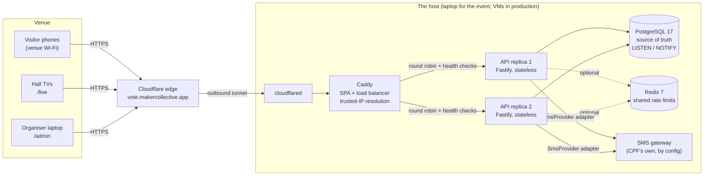
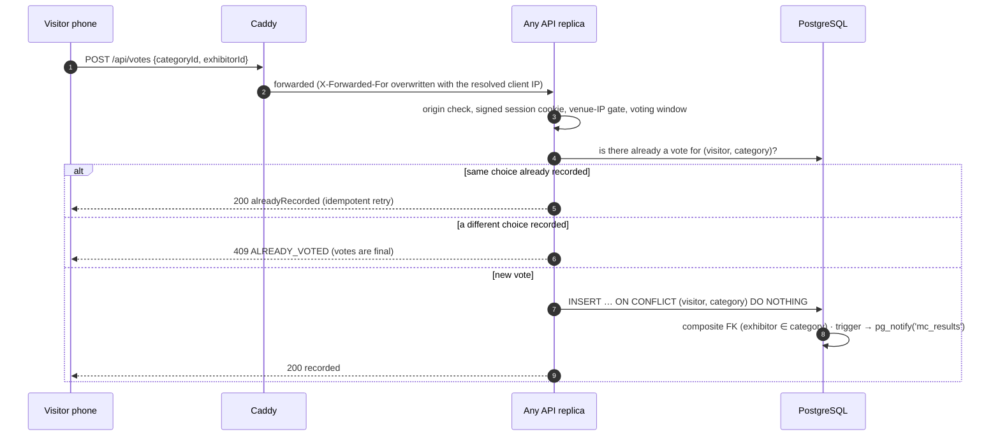
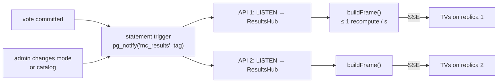

# Architecture

How the MC2026 voting system is built, and why. Companion documents: [ERD](erd.md) · [data flows](dfd.md) · [authentication and access control](auth.md) · [deployment](deployment.md) · [scaling to 1,000 users](scaling-1000-users.md). Decisions are recorded one by one in [`adr/`](adr/).

## 1. What the system has to do

| Need | Where it is solved |
|---|---|
| A visitor votes once per category, from their phone, in Arabic or English | Voter app (`/`), vote path (§4), [ERD](erd.md) |
| Only people at the venue can vote, and each is a real person (one SIM, one voter) | Venue Wi-Fi gate + SMS one-time code ([auth.md](auth.md)) |
| Live standings on the hall TVs, and a **Blind Hour** that cannot leak | Live results (§5), [ADR-003](adr/003-blind-hour-freeze.md), [ADR-006](adr/006-live-results-and-tv-displays.md) |
| Organisers run the event without a developer | Admin console (`/admin`), [runbooks](runbooks/) |
| 1,000 people at once, no single point of failure that pauses voting | Stateless replicas, Postgres as the single source of truth ([scaling](scaling-1000-users.md)) |
| Visitor personal data is protected | Field encryption, hashed phone index, masked admin views ([auth.md §6](auth.md#6-visitor-data-protection)) |

## 2. The system at a glance



Three surfaces, one bundle family, one API:

| Surface | Path | Audience | Notes |
|---|---|---|---|
| Voter app | `/` | Visitors, phones | Arabic-first, English one tap away, RTL; 48 px touch targets; offline-tolerant (idempotent retries, no false "recorded") |
| Live board | `/live` | Hall TVs | Fixed 1920×1080 artboard scaled to any screen; its own lean entry (no router, no voter code) |
| Console | `/admin` | Organisers | English, laptop-first with a phone layout; lazy-loaded so voters never download it |

## 3. Components and responsibilities

| Component | Technology | Responsibility | State it keeps |
|---|---|---|---|
| Edge | Cloudflare named tunnel → `cloudflared` | Public HTTPS on our own domain with no inbound port on the venue network | none |
| Web edge | Caddy 2 | Serves the built SPA, balances `/api/*` over the replicas with active health checks, resolves the real client IP from trusted hops only, sets the security headers | none (read-only, non-root container) |
| API | Fastify 5, TypeScript, zod | Every rule: access gate, OTP, votes, results, admin. Any replica answers any request | **none that matters**: sessions are signed cookies (visitors) or rows in Postgres (admins) |
| Database | PostgreSQL 17 | Source of truth and the integrity referee (unique, foreign-key, trigger and check constraints); fan-out via `LISTEN/NOTIFY` | all of it |
| Cache | Redis 7 (optional) | Shared rate-limit counters so limits hold across replicas | counters only, no persistence; the API runs without it (in-process fallback, `/readyz` says `degraded`) |
| SMS | `SmsProvider` interface: `console`, `demo-inbox`, `http` | Delivers the one-time code. **We** generate, hash and verify the code, so every control works with any gateway ([ADR-004](adr/004-sms-provider-strategy.md)) | outbox rows only in `demo-inbox` mode |
| Shared code | `packages/shared` | zod schemas, error codes and DTO types used by both API and web, so they cannot drift | none |

### Source layout

```
apps/api/src/
  modules/   access · auth · votes · catalog · results · display · content · admin · visitors · export · settings · sms · health
  db/        schema.ts · migrations (drizzle/) · seed · provision.ts (least-privilege role)
  plugins/   origin-guard (CSRF for visitors) · security headers · error mapping
  lib/       crypto (AES-GCM, HMAC) · ip (CIDR, IPv4/IPv6) · phone (E.164) · rate-limit · log-scrub
apps/web/src/surfaces/   vote · live · admin     (design-system/ and i18n/ are shared)
packages/shared/         contracts used on both sides
infra/                   docker-compose.yml · Caddyfile · Dockerfiles
load/                    k6 scenarios, chaos runner, integrity check
```

Each API module owns its routes, service and tests. The route table is authoritative; a route that does not declare who may call it fails at boot (`admin/guard.ts`), so a new endpoint cannot ship open by accident.

## 4. The vote path



Why this holds under pressure:

- **The database is the arbiter.** `UNIQUE(visitor_id, category_id)` and the composite foreign key `(exhibitor_id, category_id) → exhibitor_categories` mean even a bug in the API, two replicas racing, or a double tap cannot produce two votes or a vote for an exhibitor outside the category.
- **Votes are final.** No update path exists in the API, and a trigger rejects `UPDATE` (and `DELETE`/`TRUNCATE` outside an audited reset) even for a privileged connection. The application's database role has no `UPDATE` or `DELETE` privilege on `votes` at all ([ADR-009](adr/009-hardening-and-event-operations.md)).
- **Retries are safe.** A phone that loses signal sends the same vote again; the answer is "already recorded", never a second vote. The app shows "recorded" only after the server confirmed it.

## 5. Live results and the Blind Hour



- `buildFrame()` is the **only** function that produces what a TV may see. In `LIVE` it runs the leaderboard query; in `FROZEN`, `HIDDEN` and `REVEAL` the live counts are **never read**, so they cannot be found in the network tab, a refresh or the page source. A missing or unreadable snapshot fails closed (everything sealed).
- A burst of 1,000 votes costs about one query per second per replica, not 1,000: updates are coalesced (leading-edge throttle, ≤ 1/s). Measured vote-to-screen: p50 0.58 s, p95 0.61 s under the 10× stress run.
- Safety nets: a 5-second resync, automatic reconnect of the `LISTEN` connection, and a full frame on every TV connect. If `NOTIFY` were ever removed, the screens would stay correct, a fraction of a second slower.
- **Reveal:** each category's standings are stored at the moment it is announced, so a late vote cannot change an announced winner.
- TVs authenticate with a revocable `mcd_…` token (only its SHA-256 is stored); they can read the results frame and nothing else.

## 6. Cross-cutting design choices

| Concern | Decision | Reference |
|---|---|---|
| Statelessness | Visitor session = signed cookie; admin session, OTP challenges, settings, photos = Postgres. Kill any replica and nobody loses a session. | [ADR-001](adr/001-stack-and-architecture.md) |
| Configuration | Event settings (window, venue ranges, Wi-Fi, OTP policy, results mode) are database rows editable live, with optimistic-concurrency versioning; secrets are environment variables | `settings` table |
| Client IP | Only the tunnel connector may tell Caddy the client address; `X-Forwarded-For` is parsed right to left; `CF-Connecting-IP` and friends are never read | [ADR-002](adr/002-on-site-access-control.md) |
| Least privilege | The API connects as `mc_app`: DML allow-list, no DDL, no trigger or role changes, never `UPDATE`/`DELETE` on votes or the audit log. Containers are read-only with no capabilities | [ADR-009](adr/009-hardening-and-event-operations.md) |
| Photos | Validated and re-encoded server-side, stored in Postgres (≤ 350 KB each), cached for a year by URL | [ADR-008](adr/008-admin-management.md) |
| Observability | Structured logs with a scrubber (no query parameters, row values or tokens); `/healthz` for load balancing, `/readyz` internal only; append-only audit log for every admin action | `lib/log-scrub.ts`, `audit_log` |
| Operations | `stack:preflight` (is it safe to open?), `stack:reset-event` (guarded cleanup), `stack:display`, `stack:results`, `stack:admin` | [runbooks](runbooks/) |

## 7. Honest limits

- **For the event the host is one laptop.** The application layer has no single point of failure that pauses voting (two replicas, health-checked; proven by killing each in turn), but the laptop, its power and its network are one. Mitigations: mains power, a phone hotspot, a recorded backup video. [Deployment](deployment.md) shows the production topology that removes it.
- **Postgres is the one hard dependency.** In production it is a managed service with a standby; the compose file runs a single node.
- **Someone on the venue Wi-Fi but outside the hall can still vote.** The one-SIM-one-voter rule caps the damage at one vote per category per real phone number ([ADR-002](adr/002-on-site-access-control.md)).
