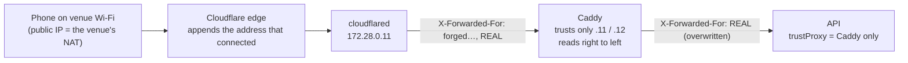
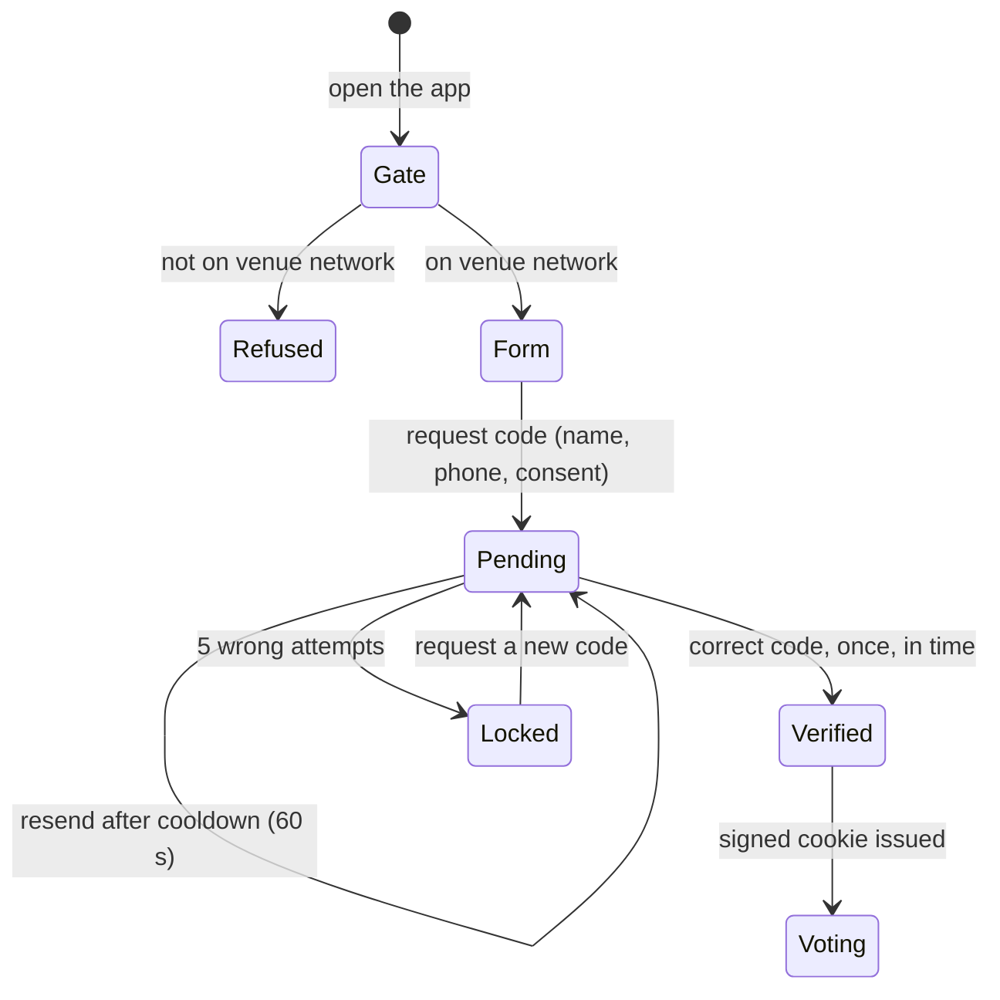
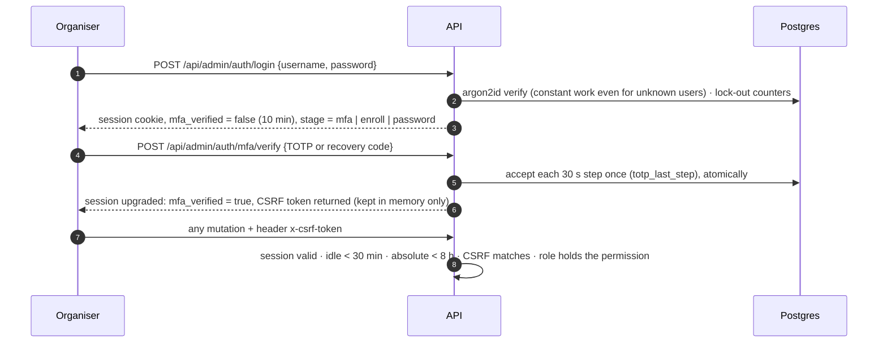

# Authentication and access control

Three kinds of caller, three different proofs. Nothing is trusted because of what the client says about itself.

| Caller | Proof | Session | What it can reach |
|---|---|---|---|
| **Visitor** | on the venue network **and** a phone that received a one-time code | signed cookie, 12 h | catalogue, own votes, cast votes |
| **TV** | a pairing token created by an organiser | `HttpOnly; SameSite=Strict` cookie scoped to `/api/display` | the results stream, nothing else |
| **Organiser** | password **and** authenticator code | database-backed session, idle 30 min, absolute 8 h | `/api/admin/*`, by role |

Decisions: [ADR-002](adr/002-on-site-access-control.md) (venue gate), [ADR-004](adr/004-sms-provider-strategy.md) (SMS), [ADR-007](adr/007-admin-authentication.md) (admin sign-in). Threats and residual risks: [`security/threat-model.md`](security/threat-model.md); control-by-control mapping: [`security/asvs-checklist.md`](security/asvs-checklist.md).

## 1. Requirement F10/F11: only people at the venue

### How the client IP is known

- A client can write anything into `X-Forwarded-For`, but Cloudflare **appends** the real connecting address, and Caddy reads the header **right to left**, accepting only hops that are its own trusted connectors. The right-most untrusted entry is the real client; forged entries on the left are ignored.
- Caddy then **overwrites** the header with that single resolved address, and Fastify trusts only Caddy's fixed address.
- `CF-Connecting-IP`, `X-Real-IP` and `True-Client-IP` are never read (on the ngrok fallback they pass through unchanged from the client).
- Verified through the real tunnel on the real domain: the API reported the laptop's true public address; forged `X-Forwarded-For`, `X-Real-IP`, `True-Client-IP` were ignored; with the gate on and no ranges configured it **fails closed** (ADR-002 table).

### The gate

`settings.venue_cidrs` (IPv4 and IPv6 ranges, editable live in the console, with "Find my address" to read it from a phone on the venue Wi-Fi). The check runs at **OTP request, OTP verify and every vote**, per route, so a new endpoint cannot silently miss it. A refused visitor gets `NOT_ON_VENUE_NETWORK` and a friendly screen with the Wi-Fi name to join. `access_mode = OFF` exists for development only and shows a loud warning in the console.

Why not GPS or a rotating QR: browser GPS is client-asserted and forgeable, is unreliable in Jordan, and a QR on a TV forces people to walk to a screen (ADR-002). A static printed QR at the entrance and booths simply opens the app.

## 2. Requirement F5/F6/F12: one real person, one voter

| Control | Setting (all editable in `settings`) |
|---|---|
| Code | 6 digits from a cryptographic random source |
| Lifetime | 5 minutes (60–900 allowed) |
| Wrong attempts | 5 per code (1–10); the attempt is **taken before** comparing, atomically, so parallel guesses cannot exceed the cap |
| Single use | `consumed_at` flips once; the consume and the identity creation are one transaction, so a database hiccup does not burn the visitor's code |
| Resend cooldown | 60 s (15–600), serialised with a per-phone advisory lock so racing taps cannot send two SMS |
| Per-phone limit | 5 requests / hour (keyed on the phone **hash**, never the number) |
| Per-device limit | 10 requests / hour, 40 verifies / 10 min (a convenience, not a boundary: the cookie is clearable) |
| Per-IP limit | 3,000 / 10 min, because the whole venue shares one address; the tight limits are per phone |
| Global ceiling | `OTP_GLOBAL_PER_HOUR` (4,000) caps SMS cost and SMS-pumping for the whole event |
| Stored form | HMAC of (challenge id + code); compared in constant time; never logged |
| Phone policy | normalised to E.164 (Arabic digits, `00962`, `07…`, spaces and direction marks all handled), prefix allow-list (`+9627` by default), invalid ranges refused |
| Enumeration | a blocked number gets an identical-looking answer and **no** SMS and no quota spent; the refusal comes only after the code proves ownership |
| Identity | created only after a successful verification. `visitors.phone_hash` is `UNIQUE`, so a phone is one visitor however it is typed |
| Consent | vote consent required; outreach consent separate and optional; both timestamped with the notice version |

**One SIM = one voter.** `UNIQUE(visitor_id, category_id)` on top of `UNIQUE(phone_hash)` means the same phone can never vote twice in a category, from any device, after any number of re-verifications ([ERD](erd.md)).

### Visitor session

`mc_session` carries `visitorId.issuedAt.expiresAt`, signed with `SESSION_SECRET`; it is `HttpOnly`, `Secure` (when the origin is https), `SameSite=Lax`, 12 hours. Any replica can verify it with no shared memory. A block or a logout takes effect on the next vote because the visitor row is re-read: `sessions_revoked_at` voids every cookie issued before it, so a captured cookie dies too. CSRF is covered by `SameSite=Lax` plus a strict `Origin` check on state-changing requests (`plugins/origin-guard.ts`: only `PUBLIC_ORIGIN` and the configured extras).

## 3. TV displays

An organiser creates a display (console or `pnpm stack:display create`). The token is `mcd_` + 256 random bits, shown **once**; only its SHA-256 is stored. The pairing link carries it in the URL **fragment** (never sent in a request, removed from the address bar immediately), it is POSTed once and then lives in an `HttpOnly; SameSite=Strict; Secure` cookie limited to `/api/display`. The stream re-checks the token on connect and the hub re-checks on a schedule, so **revoking a display sends that TV back to the pairing screen within about 5 seconds**. A display token cannot reach any other endpoint.

## 4. Organisers (requirement: admin sign-in with MFA)

| Control | Detail |
|---|---|
| Passwords | argon2id (RFC 9106) via Node's own `crypto`, PHC-encoded, parameters stored with the hash; minimum strength enforced; operator-issued temporary passwords expire unused and must be changed at first sign-in |
| Second factor | TOTP is **mandatory** for every account, enrolled at first sign-in; secret stored encrypted; each code usable once (replay guard); 10 single-use recovery codes, hashed |
| Lock-out | every 5 failures locks the account: 5 min, doubling to a 60 min cap; a SUPER_ADMIN can unlock; per-address limits stack on top |
| Sessions | opaque 256-bit token, only its SHA-256 stored; **pending** sessions (password done, MFA not) last 10 min and can only reach the MFA routes; idle timeout 30 min; absolute limit 8 h that never slides; sign-out-everywhere; disabling a user ends their sessions |
| CSRF | `SameSite=Strict` cookie **plus** a per-session `x-csrf-token` compared in constant time on every state-changing request |
| Accounts | admins are disabled, never deleted (the audit log keeps a restricting foreign key) |
| Audit | every sign-in outcome, mode change, setting change, reveal, export and unmask writes an append-only row (no secrets in `details`, asserted by a test) |

### Roles (RBAC)

The matrix is a table in code (`modules/admin/permissions.ts`), walked by a test that checks **every registered route**; a route with no declared access refuses to boot.

| Capability | SUPER_ADMIN | ADMIN |
|---|:-:|:-:|
| Overview, content (categories, exhibitors, photos), settings, results mode and reveal, live counts during the Blind Hour, TV displays, visitor list (masked), block / sign-out, **export** | ✅ | ✅ |
| Organiser accounts, reset credentials, audit log | ✅ | — |
| Unmask a visitor's real name and phone (typed reason, audited) | ✅ | — |
| Demo SMS inbox (it shows one-time codes) | ✅ | — |

Export is open to ADMIN by the organiser's decision (2026-10-07); every export is audited and filtered by consent.

## 5. Where the data is protected, in order of defence

1. **Network:** no inbound port on the venue network (outbound tunnel); database and Redis bound to loopback only.
2. **Edge:** trusted-hop IP resolution, security headers (CSP with `script-src 'self'`, HSTS, `frame-ancestors 'none'`, no referrer), `/api/readyz` hidden.
3. **Application:** per-route guards, zod validation, origin and CSRF checks, rate limits, error mapping with no internals.
4. **Database:** unique, foreign-key, check and trigger constraints that hold even if the application is wrong; the application role cannot change the schema or rewrite votes ([ADR-009](adr/009-hardening-and-event-operations.md)).
5. **Data at rest:** PII encrypted, phone and codes hashed (see §6).
6. **Evidence:** append-only audit log, log scrubbing, 367 API tests (all run as the restricted role), mutation-checked admin tests.

## 6. Visitor data protection

Jordan PDPL No. 24 of 2023 (in force since 17 March 2024) is the reference law; the points that shaped the design:

- **Consent is explicit and separate:** the vote requires consent to the notice; being contacted afterwards is a second, optional, unticked box. Each carries a timestamp and the notice version.
- **Minimisation:** a name and a mobile number; nothing else is asked.
- **Purpose limitation:** the outreach export contains only visitors who opted in; the results export carries no personal data.
- **Security:** AES-256-GCM at rest, HMAC-indexed phone, masked everywhere in the console (`+962 7•• ••• 123`); revealing a real identity needs SUPER_ADMIN, a typed reason, and leaves an audit row.
- **Retention:** the data lives in one Postgres volume on the organisers' host; `stack:reset-event` and the post-event runbook describe deletion. Defining the retention period is for the organisers (open decision in the deployment guide).
