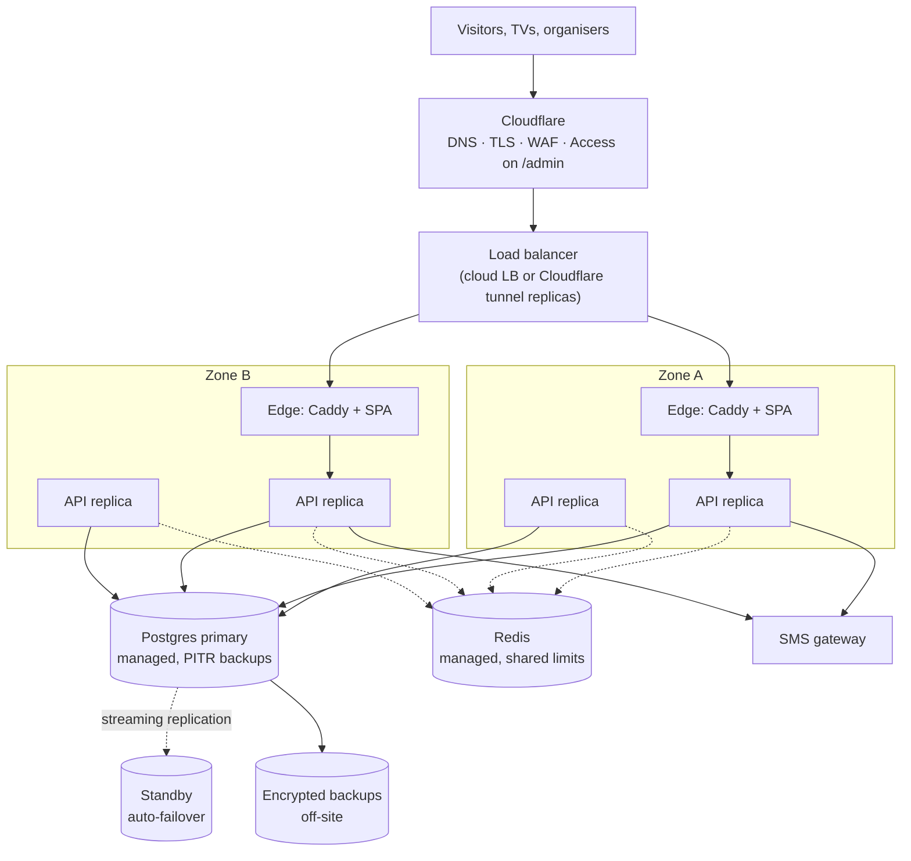

# Deployment guide

Two deployments, kept apart on purpose so nothing here overclaims:

- **Part A: the event deployment.** What we build, run and rehearsed: one host (a laptop), Docker Compose, a Cloudflare named tunnel. Every step below was executed.
- **Part B: the production topology.** What CPF would run for a long-lived or larger deployment. The application is built for it (stateless, one hard dependency), but Part B has **not been run**; it is the reasoned design, not evidence.

Operations on the day are in the runbooks: [`event-day.md`](runbooks/event-day.md), [`admin-accounts.md`](runbooks/admin-accounts.md), [`tv-and-blind-hour.md`](runbooks/tv-and-blind-hour.md), [`admin-console.md`](runbooks/admin-console.md).

---

## Part A: the event deployment

### A.1 What runs

| Service | Image | Network | Notes |
|---|---|---|---|
| `postgres` | `postgres:17-alpine` | backend; published on `127.0.0.1:55432` only | data in the `pgdata` volume |
| `redis` | `redis:7-alpine` | backend; `127.0.0.1:56379` only | no persistence, 64 MB, LRU; optional |
| `migrate` | the API image | backend | runs migrations, provisions the `mc_app` role, then exits. Also the container for operator commands (`stack:*`). The **only** service holding the database owner's password |
| `api1`, `api2` | the API image | backend | stateless; read-only filesystem, no capabilities, 1 GB, 256 processes; connect as `mc_app` |
| `caddy` | built from `infra/web.Dockerfile` (SPA + Caddy) | backend (172.28.0.10); published on `127.0.0.1:8080` | non-root, read-only, no capabilities |
| `cloudflared` | `cloudflare/cloudflared` (profile `tunnel`) | backend (172.28.0.11) | outbound tunnel to Cloudflare; routes the public hostname to `http://caddy:80` |

Nothing is reachable from the venue network directly: the only way in is the outbound tunnel.

### A.2 Prerequisites

- Docker Desktop (Compose v2), Node ≥ 24.7, pnpm 11 (`corepack enable`).
- A Cloudflare account with the domain's zone (`makercollective.app`) and a **named tunnel** whose public hostname `vote.makercollective.app` points to service `http://caddy:80` (Zero Trust → Networks → Tunnels). Turn **Web Analytics off** for the hostname.
- The organisers' SMS gateway details (URL, auth header, body template), or, for a rehearsal only, the demo SMS inbox.

### A.3 First-time setup

```bash
pnpm install --frozen-lockfile
node scripts/gen-env.mjs                 # creates .env with random secrets (never overwrites existing keys)
# edit .env: STACK_PUBLIC_ORIGIN=https://vote.makercollective.app, CLOUDFLARE_TUNNEL_TOKEN, SMS_*, STACK_NODE_ENV=production
pnpm stack:up                            # builds images, migrates, provisions mc_app, starts api1/api2/caddy
pnpm stack:tunnel                        # starts cloudflared (fails fast if the token is missing)
pnpm stack:admin create <username> SUPER_ADMIN   # prints a temporary password ONCE
# sign in at https://vote.makercollective.app/admin: authenticator + save recovery codes + choose a password
pnpm stack:display create "Main hall"    # one per TV; the pairing link is shown once
pnpm stack:preflight                     # every line ok (or an understood WARN) before opening
```

`stack:seed` / `stack:seed:dev` load demo content for rehearsal only; the real event uses the console to enter categories, exhibitors and photos.

### A.4 Configuration reference

Secrets and deployment switches are environment variables (`.env`, git-ignored). Event behaviour is **not**: it lives in the `settings` table and is edited live in the console.

| Variable | Purpose | Notes |
|---|---|---|
| `STACK_PUBLIC_ORIGIN` | The one public address (`https://vote.makercollective.app`) | Drives the origin (CSRF) check, the cookie `Secure` flag, TV pairing links and the host in the SMS text. Change it in one place |
| `STACK_NODE_ENV` | `production` at the event | demo SMS adapters are refused in production unless `DEMO_MODE=true` |
| `SESSION_SECRET` | Signs visitor cookies | ≥ 32 chars; rotating it signs everyone out |
| `PII_ENCRYPTION_KEY` | AES-256-GCM key for names, phones, TOTP secrets | 32 random bytes, base64. **Losing it makes stored PII unreadable; changing it without migration does too.** Back it up separately from the database |
| `PHONE_HASH_PEPPER` | HMAC key for the unique phone index | ≥ 32 chars. Changing it breaks "same phone = same visitor" for existing rows |
| `POSTGRES_PASSWORD` | Database owner | reaches the migrate container only |
| `APP_DB_PASSWORD` | Password of the `mc_app` role | reaches api1/api2 and migrate only |
| `SMS_PROVIDER` | `http` at the event; `demo-inbox` / `console` for rehearsal | [ADR-004](adr/004-sms-provider-strategy.md) |
| `SMS_HTTP_URL`, `SMS_HTTP_AUTH_HEADER`, `SMS_HTTP_BODY_TEMPLATE`, `SMS_HTTP_TIMEOUT_MS` | The organisers' gateway | handing over = filling these in; no code change |
| `OTP_GLOBAL_PER_HOUR` | SMS ceiling for the whole event | default 4,000 |
| `DATABASE_POOL_MAX` | Connections per replica | default 10 |
| `EXTRA_ORIGINS` | Additional allowed browser origins | e.g. `http://localhost:8080` for local testing |
| `CLOUDFLARE_TUNNEL_TOKEN` | Tunnel credential | reaches only the `cloudflared` container |

Back up `.env` (especially the three keys) somewhere other than the laptop. Without them a restored database is unreadable.

### A.5 Verifying a deployment

```bash
docker compose --env-file .env -f infra/docker-compose.yml --profile full ps       # all healthy
curl -s https://vote.makercollective.app/api/healthz                                # 200
curl -s -o /dev/null -w '%{http_code}\n' https://vote.makercollective.app/api/readyz  # 404 (hidden at the edge on purpose)
pnpm stack:preflight                                                                # readiness report
```

From a phone on the venue Wi-Fi, `https://vote.makercollective.app/api/access/status` must say you are inside; from mobile data, outside.

### A.6 Failure and recovery (event host)

| Failure | Effect | Recovery |
|---|---|---|
| One API replica dies | none visible: Caddy's health check moves traffic in seconds (load report: 0 failed requests) | `docker start mc2026-api1-1` |
| Both replicas down | 503 for ~10–20 s until one passes its health check | Compose restarts them (`unless-stopped`); `docker start` both |
| Redis down | rate limits fall back to per-replica memory; `/readyz` says `degraded`; voting continues | `docker start mc2026-redis-1` |
| Tunnel drops | phones and TVs cannot reach the site; SSE reconnects by itself | `pnpm stack:tunnel`; fall back to the phone hotspot |
| Postgres down | voting stops (the one hard dependency); nothing is lost | `docker start`; the volume holds all data |
| Laptop restarts | everything stops | Docker Desktop, `pnpm stack:up`, `pnpm stack:tunnel`; no data lost |
| Laptop lost | the event host is a single point of failure | the recorded backup video; a second prepared laptop restoring a dump is the stretch mitigation |

**Backup during the event:** `docker exec mc2026-postgres-1 pg_dump -U mc -Fc mc > backup-$(date +%H%M).dump` (a vote is ~100 bytes; the whole event is well under a megabyte of votes). Keep it with the `.env` keys.

---

## Part B: the production topology

For a long-lived deployment (or an event where one host is not acceptable). Nothing in the application changes; only where the pieces run.



| Layer | Recommendation | Why |
|---|---|---|
| Compute | ≥ 2 API replicas in ≥ 2 zones on a container platform or VMs (the image is the unit; no host state) | replicas are interchangeable; losing a zone loses half the capacity, not the service |
| Edge | Caddy + SPA per zone, or serve the static SPA from a CDN and route `/api/*` to the replicas | the SPA is static files; `/api/*` is the only dynamic path |
| Database | **Managed PostgreSQL 17 with a synchronous or asynchronous standby, automatic failover, point-in-time recovery** | Postgres is the one hard dependency: this is the single most valuable change from Part A |
| Redis | Managed Redis (any single instance is enough); optional | only shared rate-limit counters; the application degrades gracefully without it |
| Secrets | A secrets manager (not `.env`); separate values per environment; the three keys backed up apart from the database | `PII_ENCRYPTION_KEY` loss is unrecoverable |
| TLS / WAF | Terminate at Cloudflare or the cloud LB. Add an **Access / WAF rule on `/admin*` and `/api/admin*`** (organiser-only) | closes risk R-A2 without code changes |
| Observability | Ship the structured JSON logs (already scrubbed of values and tokens) to a log service; alert on 5xx rate, `/healthz` failures, replica restarts, Postgres connections | |
| Backups | Daily full + continuous WAL archiving; restore tested; encrypted at rest and off-site | |

### Connection budget (the one scaling arithmetic to remember)

Each replica opens up to `DATABASE_POOL_MAX` (10) pooled connections **plus one** dedicated `LISTEN` connection for live results. The `mc_app` role is capped at 60 connections. So N replicas need N × 11 ≤ 60, i.e. **up to 5 replicas as shipped**. Beyond that raise the role's `CONNECTION LIMIT` (and the server's `max_connections`) or reduce the pool; at the measured load each replica used 19–28 % of one core, so five replicas are far more than 1,000 visitors need. If a connection pooler (PgBouncer) is added, the `LISTEN` connection must bypass it or use session pooling: transaction pooling breaks `LISTEN/NOTIFY`.

### Rolling updates and rollback

1. Build and tag the image from a commit; run the migrations once (the `migrate` step is idempotent and re-provisions the application role).
2. Replace replicas one at a time behind the health check; each restart drains its SSE connections and TVs reconnect to a sibling in seconds.
3. Rollback = redeploy the previous image. Migrations are forward-only and additive; a destructive migration needs its own plan.

### Capacity sizing

Per [scaling-1000-users.md](scaling-1000-users.md): 2 replicas used about a quarter of one core each at 467 requests per second. Production sizing of 2 × (1 vCPU, 1 GB) plus a small managed Postgres comfortably covers a 1,000-person event; scale replicas for larger crowds within the connection budget above.

### Open decisions for the organisers

| Decision | Why it matters |
|---|---|
| **Data retention period** for visitor names and phone numbers after the event | PDPL purpose limitation; the system can delete (`stack:reset-event`, drop of the volume) but the period is a policy decision |
| Who holds the three keys and the Cloudflare account after handover | continuity and recovery |
| Whether `/admin` is restricted to organiser networks or identities (Cloudflare Access) | removes the console from the public internet |
| Which SMS gateway, and its per-second limit | the likely real bottleneck for sign-in at a 1,000-person rush |
