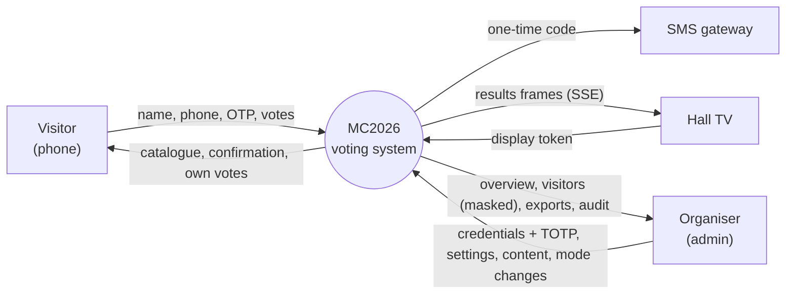
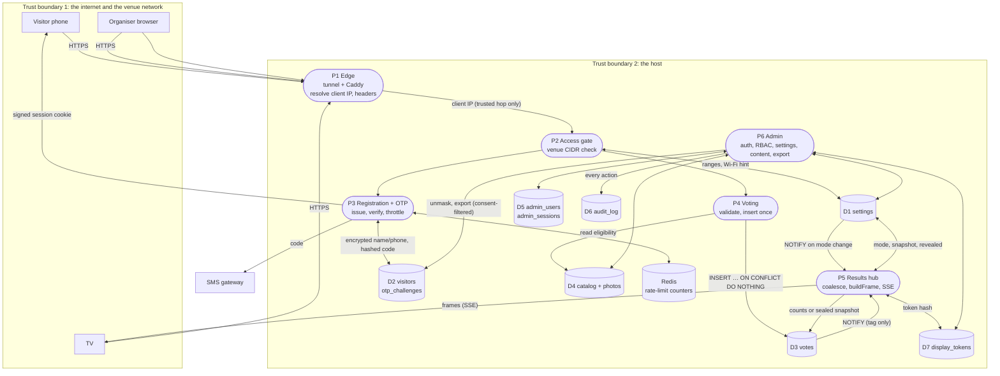
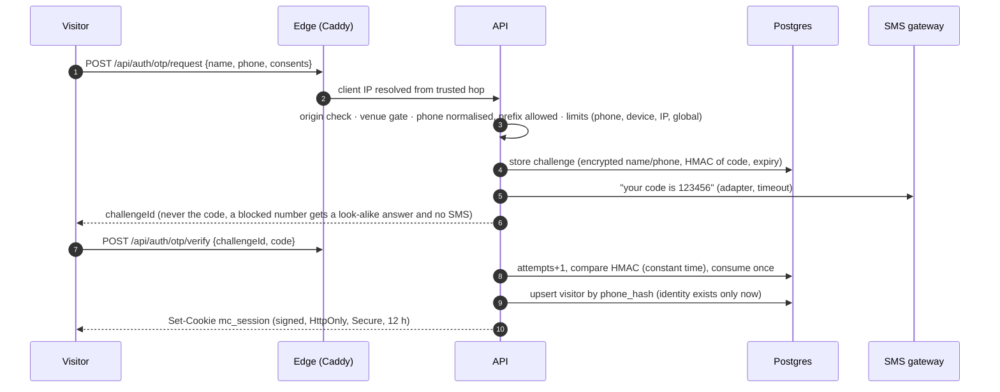
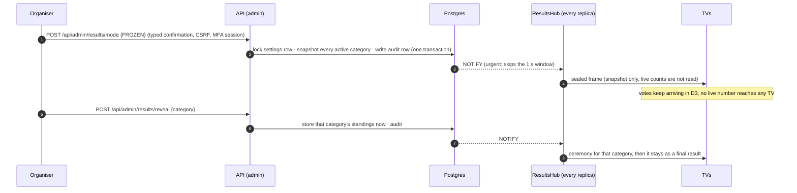

# Data flow diagrams

Where data goes, where it is stored, and where it crosses a trust boundary. Notation: rectangles are external actors, rounded boxes are processes, cylinders are stores. Dashed boxes are trust boundaries.

## 1. Level 0: context

## 2. Level 1: processes and stores

## 3. Data inventory

| Data | Entered at | Stored in | Form | Who can read it | Leaves the system? |
|---|---|---|---|---|---|
| Visitor name, phone | sign-in | D2 `visitors` | AES-256-GCM | API (to send the SMS and to unmask); SUPER_ADMIN only, with a typed reason, audited | phone goes to the SMS gateway to deliver the code |
| Phone hash | sign-in | D2 | HMAC-SHA256 + pepper | API only | no |
| One-time code | generated server-side | D2 `otp_challenges` | HMAC | nobody (only compared) | in the SMS text |
| Consent (vote, outreach, version) | sign-in | D2 | timestamps | ADMIN/SUPER_ADMIN | the outreach list exports only consenting visitors |
| Vote | vote screen | D3 | plain ids + time + client IP | aggregated for TVs; individual rows only via export (audited) | CSV export |
| Client IP | every request | D3, D2, logs | text | admins | no |
| Venue ranges, Wi-Fi name/password | console | D1 | plain | admins; the Wi-Fi name is shown to a blocked visitor | no |
| Admin password, TOTP secret, recovery codes | console / CLI | D5 | argon2id / AES-GCM / SHA-256 | API only | no |
| Photos | console | D4 | validated WebP | public by URL (they are the catalogue) | no |
| Audit entries | every admin action | D6 | jsonb, append-only | SUPER_ADMIN | no |

## 4. Flow: sign-in (registration + one-time code)

## 5. Flow: Blind Hour and reveal

## 6. Trust boundaries and what is checked at each

| Boundary crossed | Check |
|---|---|
| Internet → host | TLS at Cloudflare; the tunnel is outbound-only (no inbound port on the venue network); Caddy accepts the client IP only from the connector's fixed address |
| Edge → API | the API trusts `X-Forwarded-For` from Caddy's address only; `CF-Connecting-IP`, `X-Real-IP`, `True-Client-IP` are never read |
| Visitor → API | origin check (CSRF), signed session, venue gate on sign-in and on **every** vote, schema validation (zod) on every body |
| TV → API | revocable display token in an `HttpOnly; SameSite=Strict` cookie scoped to `/api/display`; the stream re-checks it |
| Organiser → API | password + TOTP, DB-backed session, per-session CSRF token, role permission per route ([auth.md](auth.md)) |
| API → Postgres | least-privilege role `mc_app`; every query parameterised; constraints and triggers hold regardless |
| API → SMS gateway | outbound only, timeout, the code is generated and verified by us |
