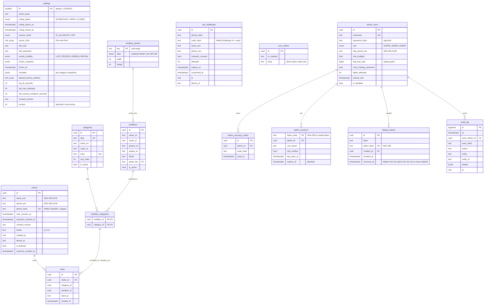

# Data model (ERD)

PostgreSQL 17, schema in `apps/api/src/db/schema.ts`, migrations in `apps/api/drizzle/` (0000–0010). The design rule: **the database enforces what must never be wrong**; the application translates database outcomes into friendly answers.

## 1. Entity-relationship diagram

`otp_challenges` is deliberately not linked to `visitors`: a registration is only a *pending* row until the code is verified. A visitor row exists only for a phone that proved it holds the number. `settings` is a single-row table (a `CHECK (id = 1)` makes a second row impossible).

## 2. The constraints that carry the integrity guarantees

| Guarantee | Mechanism | Table |
|---|---|---|
| One vote per visitor per category | `UNIQUE (visitor_id, category_id)` | `votes` |
| An exhibitor can only receive votes in a category it competes in | composite `FOREIGN KEY (exhibitor_id, category_id) → exhibitor_categories` (`ON DELETE RESTRICT`) | `votes` |
| A real person is counted once, however the number is typed | `phone_hash` = HMAC-SHA256(pepper, E.164) with `UNIQUE`; `+962 79 …`, `00962 79…`, `079…`, spaces, invisible direction marks and Arabic-Indic digits all normalise to one value first | `visitors` |
| Votes are final | trigger `votes_guard`: `UPDATE` always raises; `DELETE`/`TRUNCATE` only inside an explicit, audited reset (`SET LOCAL mc.allow_vote_reset`) | `votes` |
| The audit trail cannot be rewritten | triggers reject `UPDATE`, `DELETE`, `TRUNCATE`; the actor FK is `RESTRICT` so admins are disabled, never deleted | `audit_log` |
| Only one settings row, always present | `CHECK (id = 1)`, seeded by migration | `settings` |
| Settings stay sane | checks: window order, OTP ttl 60–900 s, attempts 1–10, cooldown 15–600 s; a `FROZEN` mode requires a stored snapshot | `settings` |
| Venue ranges are valid networks | column type `cidr[]` (Postgres rejects malformed input at write time) | `settings` |
| An account can't claim MFA without a secret | `CHECK (mfa_enabled = false OR totp_secret_enc IS NOT NULL)` | `admin_users` |
| Storage keys and photos are server-made and bounded | key pattern checks; `octet_length(data)` ≤ 358,400 | `exhibitor_photos`, `exhibitors` |
| A recovery code can't be duplicated | `UNIQUE (admin_id, code_hash)` | `admin_recovery_codes` |
| Dashboards hear about every change, whoever made it | statement-level triggers on `votes`, `settings`, catalog tables and `display_tokens` call `pg_notify('mc_results', tag)` (tag only, never data) | several |
| The API can't undo any of the above | application role `mc_app` has no `UPDATE`/`DELETE` on `votes` or `audit_log`, no DDL, cannot disable triggers (`provision.test.ts` asserts each is refused) | role |

Everything above is covered by integration tests that run **as `mc_app`**; the tests of the triggers and checks connect as the owner on purpose, so they are proven to hold even against a privileged connection.

## 3. Indexes

| Index | Serves |
|---|---|
| `votes (category_id, exhibitor_id)` | the leaderboard `GROUP BY` as an index-only scan |
| `exhibitor_categories (category_id)` | the catalogue read |
| `otp_challenges (phone_hash, created_at desc)`, `(device_id, created_at desc)` | resend cooldown and per-phone / per-device limits |
| `visitors (device_id)` | fraud lookups in the console |
| `admin_sessions (admin_id)`, `(expires_at)` | sign-out-everywhere and the expiry sweep |
| `audit_log (at desc)`, `(entity, entity_id)` | the audit screen |
| `sms_outbox (created_at desc)` | the demo inbox |

## 4. What is encrypted, hashed or plain

| Data | Form at rest | Why |
|---|---|---|
| Visitor name, phone | AES-256-GCM envelope (versioned, bound to the table/column as additional data) | readable only by the API with `PII_ENCRYPTION_KEY`; a database dump alone shows nothing |
| Phone, for uniqueness and lookups | HMAC-SHA256 with a secret pepper | deterministic, so it can be unique; cannot be reversed or brute-forced without the pepper |
| One-time code | HMAC of (challenge id + code) | a leaked table is useless; the code is never logged |
| Admin password | argon2id (PHC string) | memory-hard |
| Admin TOTP secret | AES-256-GCM envelope | needed in clear to verify a code, so encrypted not hashed |
| Recovery codes, admin session tokens, display tokens | SHA-256 of a 256-bit random value | high-entropy secrets: a fast hash is enough, and a leak gives no usable credential |
| Vote | plain: `visitor_id`, category, exhibitor, time, client IP | the vote ledger is pseudonymous: the visitor id is a random UUID, and the identity behind it needs the encryption key |
